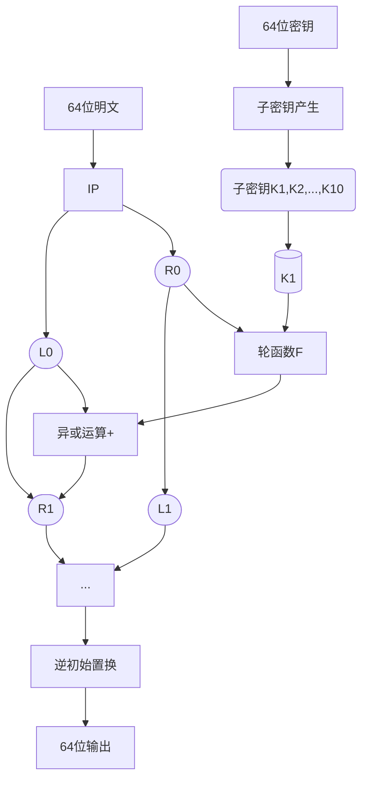
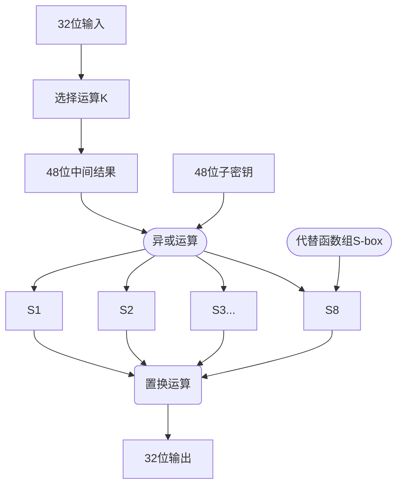

## Ch3 分组密码

<font color=ad3f26 size=4>
（本讲主要介绍DES和AES的算法和详细过程）
</font>

<font face="SimSun.ttf">DES的明文、密文和密钥的分组长度都是64位，面向二进制数据，综合运用了置换、代替、代数等基本密码技术，加密和解密共用了同一个算法，其基本密码结构属于Feistel结构。</font>

### DES

#### DES算法框图



加密的迭代过程如下：
$$
R_i = L_{i-1} \oplus F(R_{i-1}, K_i) \\L_i = R_{i-1}
$$
解密的迭代过程如下：
$$
R_{i-1}=L_{i} \oplus F(L_{i}, K_{i-1})\\ R_{i-1} = L_{i}
$$
**关于加密函数（轮函数）f：保密的核心**



**DES具有可逆性和对合性**，

#### 参考代码实现

```cpp
bitset<32> generateOutput(bitset<32> r, bitset<32> k) {
    bitset<48> expandR;
    for (int i = 0; i < expandR.size(); i++) {
        expandR[expandR.size() - i - 1] = r[r.size() - E[i]];
    }
    expandR = expandR ^ k;
    bitset<32> result;
    for (int i = 0; i < expandR.size(); i += 6) {
        int row = expandR[expandR.size() - i - 1] * 2 + expandR[expandR.size() - i - 6];
        int col = expandR[expandR.size() - i - 2] * 8 + expandR[expandR.size() - i - 3] * 4 + expandR[expandR.size() - i - 4] * 2 + expandR[expandR.size() - i - 5];
        int num = SBox[i / 6][row][col];
        bitset<4> binary(num);
        output[output.size() - (i / 6) * 4 - 1] = binary[3];
        output[output.size() - (i / 6) * 4 - 2] = binary[2];
        output[output.size() - (i / 6) * 4 - 3] = binary[1];
        output[output.size() - (i / 6) * 4 - 4] = binary[0];
    }
    bitset<32> tmp = output;
    for (int i = 0; i < output.size(); i++) {
        output[output.size() - i - 1] = tmp[tmp.size() - P[i]];
    }
    return output;
}
bitset<28> leftShift(bitset<28> k, int shift) {
    bitset<28> tmp = k;
    for (int i = k.size() - 1; i >= 0; i--) {
        k[i] = tmp[(i - shift) % k.size()];
    }
    return k;
}
void generateKeys() {
    bitset<56> rkey;
    bitset<28> lhs;
    bitset<28> rhs;
    bitset<48> compressKey;
    for (int i = 0; i < rkey.size(); i++) {
        rkey[rkey.size() - i - 1] = key[64 - PC1[i]];
    }
    for (int round = 0; round < 16; round++) {
        for (int i = lhs.size(); i < lhs.size() * 2; i++) {
            lhs[i - lhs.size()] = rkey[i];
        }
        for (int i = 0; i < rhs.size(); i++) {
            rhs[i] = rkey[i];
        }
        lhs = leftShift(lhs, shiftBits[round]);
        rhs = rightShift(rhs, shiftBits[round]);
        for (int i = lhs.size(); i < lhs.size() * 2; i++) {
            rkey[i] = lhs[i - lhs.size()];
        }
        for (int i = 0; i < rhs.size(); i++) {
            rkey[i] = rhs[i];
        }
        for (int i = 0; i < compressKey.size(); i++) {
            compressKey[compressKey.size() - i - 1] = rkey[56 - PC2[i]];
        }
        subkey[round] = compressKey;
    }
}
bitset<64> toBitset(string s) {
    bitset<64> bits;
    for (int i = 0; i < 8; i++) {
        for (int j = 0; j < 8; j++) {
            bits[i * 8 + j] = ((s[i] >> j) & 1);
        }
    }
    return bits;
}
bitset<64> encrypt(bitset<64> &plain) {
    bitset<64> cipher;
    bitset<64> currentBits;
    bitset<32> lhs;
    bitset<32> rhs;
    bitset<32> newLhs;
    for (int i = 0; i < currentBits.size(); i++) {
        currentBits[currentBits.size() - i - 1] = plain[64 - IP[i]];
    }
    for (int i = lhs.size(); i < rhs.size() * 2; i++) {
        lhs[i - lhs.size()] = currentBits[i];
    }
    for (int i = 0; i < rhs.size(); i++) {
        rhs[i] = currentBits[i];
    }
    for (int round = 0; round < 16; round++) {
        newLhs = rhs;
        rhs = lhs ^ generateOutput(rhs, subkey[round]);
        lhs = newLhs;
    }
    for (int i = 0; i < lhs.size(); i++) {
        cipher[i] = lhs[i];
    }
    for (int i = rhs.size(); i < rhs.size() * 2; i++) {
        cipher[i] = rhs[i - 32];
    }
    currentBits = cipher;
    for (int i = 0; i < cipher.size(); i++) {
        cipher[cipher.size() - i - 1] = currentBits[64 - IP1[i]];
    }
    return cipher;
}
bitset<64> decrypt(bitset<64> &cipher) {
    bitset<64> plain;
    bitset<64> currentBits;
    bitset<32> lhs;
    bitset<32> rhs;
    bitset<32> newLhs;
    for (int i = 0; i < currentBits.size(); i++) {
        currentBits[currentBits.size() - i - 1] = plain[64 - IP[i]];
    }
    for (int i = lhs.size(); i < rhs.size() * 2; i++) {
        lhs[i - lhs.size()] = currentBits[i];
    }
    for (int i = 0; i < rhs.size(); i++) {
        rhs[i] = currentBits[i];
    }
    for (int round = 0; round < 16; round++) {
        newLhs = rhs;
        rhs = lhs ^ generateOutput(rhs, subkey[15 - round]);
        lhs = newLhs;
    }
    for (int i = 0; i < lhs.size(); i++) {
        plain[i] = lhs[i];
    }
    for (int i = rhs.size(); i < rhs.size() * 2; i++) {
        plain[i] = rhs[i - 32];
    }
    currentBits = cipher;
    for (int i = 0; i < cipher.size(); i++) {
        plain[plain.size() - i - 1] = currentBits[64 - IP1[i]];
    }
    return plain;
}
void test() {
    string s = "romantic";
    string k = "12345678";
    bitset<64> plain = charToBitset(s);
    key = charToBitset(k);
    generateKeys();
    bitset<64> cipher = encrypt(plain);
    fstream file1;
    file1.open("source.txt", ios::binary | ios::out);
    file1.write(reinterpret_cast<char *>(&cipher), sizeof(cipher));
    file1.close();

    bitset<64> temp;
    file1.open("source.txt", ios::binary | ios::in);
    file1.write(reinterpret_cast<char *>(&temp), sizeof(temp));
    file1.close();

    bitset<64> tempPlain = decrypt(temp);
    file1.open("source.txt", ios::binary | ios::out);
    file1.write(reinterpret_cast<char *>(&tempPlain), sizeof(tempPlain));
    file1.close();
}
```

#### DES的安全性？？

DES是经不起穷举攻击的。

- 安全弱点（最根本在于）：密钥太短，只有56个有效比特

【由此开发了3DES，112个有效比特】

- 存在弱密钥和半弱密钥：在每次迭代时都有一个子密钥供加密使用，如果给定初始密钥k，由于各轮的子密钥都相同，那么就可以计算出所有的k。半弱密钥则是指由给定k产生的所有密钥中有不完全相同的重复者。
- 存在互补对称性，如果两个密钥互补的结果等于0，那么这两个密钥是对称的。

### AES（Rijndael）

AES 是 128 位分组加密算法，其密钥长度为 128、192、256 位，采用了【混淆】和【扩散】两大特性。

S盒的设计准则——混淆；P盒的设计准则——扩散

AES的数据处理方式：

- 按字节处理
- 按字处理
- 按状态处理

AES的数据处理过程图示：
$$
\begin{array}{ll}
x=x_0x_1x_2...x_{127}
\end{array}=
\begin{pmatrix}
x_{0}&x_{1}&x_{2}&x_{3} \\
x_{4}&x_{5}&x_{6}&x_{7} \\
x_{8}&x_{9}&x_{10}&x_{11} \\
x_{12}&x_{13}&x_{14}&x_{15}
\end{pmatrix}=
\begin{pmatrix}
s_{00}&s_{01}&s_{02}&s_{03} \\
s_{10}&s_{11}&s_{12}&s_{13} \\
s_{20}&s_{21}&s_{22}&s_{23} \\
s_{30}&s_{31}&s_{32}&s_{33}
\end{pmatrix}=
\begin{pmatrix}

\end{pmatrix}
$$

#### AES的算法结构


**详细介绍**

初始轮变换（非线性层 S盒变换 ByteSub/State）

- S盒是AES中的唯一一个非线性变换，是AES安全的关键
- 核心运算：$GF(2^8)$——用多项式$a_7x^7+a_6x^6+a_5x^5+a_4x^4+a_3x^3+a_2x^2+a_1x^1+a_0x^0$表示比特位的有限域
    - 将输入字节用$GF(2^8)$上的逆来替代
    - 倒序+仿射变换

线性混合层（行移位变换 ShiftRow、列混合变换 MixColumn）

- 第0行不移位，第一行移动C1字节，第二行移动C2字节，第三行移动C3字节
$$
\begin{pmatrix}
s_{00}&s_{01}&s_{02}&s_{03}\\
s_{10}&s_{11}&s_{12}&s_{13}\\
s_{20}&s_{21}&s_{22}&s_{23}\\
s_{30}&s_{31}&s_{32}&s_{33}\\
\end{pmatrix}\Longrightarrow
\begin{pmatrix}
s_{00}&s_{01}&s_{02}&s_{03}\\
s_{11}&s_{12}&s_{13}&s_{10}\\
s_{21}&s_{22}&s_{20}&s_{21}\\
s_{32}&s_{30}&s_{31}&s_{32}\\
\end{pmatrix}
$$
- 将状态的每列视为$GF(2^8)$上的多项式$a(x)$，乘上一个多项式$c(x)$（<font color=2c4f91>与$x^4+1$互素</font>），模$x^4+1$，即
  $$
  \begin{pmatrix}
  a_0\\
  a_1\\
  a_2\\
  a_3
  \end{pmatrix}=
  \begin{pmatrix}
  b_{00}&b_{01}&b_{02}&b_{03}\\
  b_{10}&b_{11}&b_{12}&b_{13}\\
  b_{20}&b_{21}&b_{22}&b_{23}\\
  b_{30}&b_{31}&b_{32}&b_{33}\\
  \end{pmatrix}
  \begin{pmatrix}
  02\\
  03\\
  01\\
  01
  \end{pmatrix}
  $$
  密钥加层（AddRoundKey）【注意：最后一轮中没有密钥加变换】

#### 参考代码实现

```cpp
const int NR = 10;
const int NC = 4;
bitset<8> preprocess(array<bitset<32>, 4> bytes) {
    bitset<8> wordres = 0x00000000, temp;
    for (int i = 0; i < bytes.size(); i++) {
        temp = bytes[i].to_ulong();
        temp <<= (3 - i) * 8;
        wordres |= temp;
    }
    return wordres;
}
bitset<8> subword(bitset<32> sw) {
    word temp;
    for (int i = 0; i < sw.size(); i += 8) {
        int row = sw[i + 7] * 8 + sw[i + 6] * 4 + sw[i + 5] * 2 + sw[i + 4];
        int col = sw[i + 3] * 8 + sw[i + 2] * 4 + sw[i + 1] * 2 + sw[i];
        byte tempvar = SBox[row * 16 + col];
        for (int j = 0; j < 8; j++) {
            temp[i + j] = tempvar[j];
        }
    }
    return temp;
}
inline bitset<8> cycword(bitset<32> rw) {
    return (rw << 8) ^ (rw >> 24);
}
void keyExpansion(array<bitset<8>, 4 * NC> key, array<bitset<32>, 4 * (NR + 1)> w) {
    bitset<32> temp;
    int i = 0;
    while (i < NC) {
        w[i] = bitset<32>(key[4 * i], key[4 * i + 1], key[4 * i + 2], key[4 * i + 3]);
        i++;
    }
    while (i < 4 * (NR + 1)) {
        temp = w[i - 1];
        if (i % NC == 0) {
            w[i] = w[i - NC] ^ subword(cycword(temp)) ^ rcon[i / NC - 1];
        } else {
            w[i] = w[i - NC] ^ temp;
        }
        i++;
    }
}
bitset<8> GFMul(bitset<8> lhs, bitset<8> rhs) {
    bitset<8> p(0);
    for (int i = 0; i < 8; i++) {
        if (b[0] == 1) {
            p ^= a;
        }
        int temp = a[7];
        a <<= 1;
        if (temp == 1) {
            a ^= 0x1b;
        }
        b >>= 1;
    }
    return p;
}
bitset<8> roundKeyAdd(array<bitset<8>, 16> statusMatrix, array<bitset<32>, 4> word) {
    array<bitset<32>, 4> temp;
    for (int i = 0; i < word.size(); i++) {
        for (int j = 0; j < word.size(); j++) {
            temp[i] = word[i] << (i * 8) >> 24;
        }
        for (int j = 0; j < word.size(); j++) {
            statusMatrix[i + j * 4] ^= bitset<8>(temp[i].to_ulong());
        }
    }
}
void subBytes(array<bitset<8>, 16> statusMatrix) {
    for (int i = 0; i < statusMatrix.size(); i++) {
        int row = statusMatrix[i][7] * 8 + statusMatrix[i][6] * 4 + statusMatrix[i][5] * 2 + statusMatrix[i][4];
        int col = statusMatrix[i][3] * 8 + statusMatrix[i][2] * 4 + statusMatrix[i][1] * 2 + statusMatrix[i][0];
        statusMatrix[i] = SBox[row * 16 + col];
    }
}
void shiftRow(array<bitset<8>, 16> statusMatrix) {
    for (int i = 0; i < 4; i++) {
        array<bitset<8>, i> temp;
        for (int j = 0; j < i; j++) {
            temp[j] = statusMatrix[i * 4 + j];
        }
        for (int j = 0; j < 4 - i; j++) {
            statusMatrix[i * 4 + j] = statusMatrix[i * 4 + j + i];
        }
        for (int j = 4 - i; j < 4; j++) {
            statusMatrix[i * 4 + j] = temp[i + j - 4];
        }
    }
}
void invShiftRow(array<bitset<8>, 16> statusMatrix) {
    for (int i = 0; i < 4; i++) {
        array<bitset<8>, i> temp;
        for (int j = 0; j < i; j++) {
            temp[j] = statusMatrix[i * 4 + 3 - j];
        }
        for (int j = 0; j < 4 - i; j++) {
            statusMatrix[i * 4 + 3 - j] = statusMatrix[i * 3 + 3 - j];
        }
        for (int j = 0; j < i; j++) {
            statusMatrix[i * 4 + j] = temp[i - j - 1];
        }
    }
}
void mixColumns(array<bitset<8>, 16> statusMatrix, array<bitset<8>, 16> s) {
    array<bitset<8>, 4> matrix;
    for (int i = 0; i < matrix.size(); i++) {
        for (int j = 0; j < matrix.size(); j++) {
            matrix[j] = statusMatrix[i + j * 4];
        }
        for (int j = 0; j < matrix.size(); j++) {
            statusMatrix[i + j * 4] = GFMul(s[j * 4], matrix[0]) ^ GFMul(s[j * 4 + 1], matrix[1]) ^ 
                                        GFMul(s[j * 4 + 2], matrix[2]) ^ GFMul(s[j * 4 + 3], matrix[3]);
        }
    }
}
void encrypt(array<bitset<8>, 16> statusMatrix, array<bitset<32>, 4 * (NR + 1)> word) {
    array<bitset<32>, 4> key;
    for (int i = 0; i < key.size(); i++) {
        key[i] = word[i];
    }
    roundKeyAdd(statusMatrix, key);
    for (int i = 1; i <= NR; i++) {
        subBytes(statusMatrix);
        shiftRow(statusMatrix);
        mixColumns(statusMatrix, encryS);
        for (int j = 0; j < 4; j++) {
            key[j] = word[4 * i + j];
        }
        roundKeyAdd(statusMatrix, key);
    }
    subBytes(statusMatrix);
    shiftRow(statusMatrix);
    for (int i = 0; i < 4; i++) {
        key[i] = word[4 * NR + i];
    }
    roundKeyAdd(statusMatrix, key);
}
void decrypt(array<bitset<8>, 16> statusMatrix, array<bitset<32>, 4 * (NR + 1)> word) {
    array<bitset<32>, 4> key;
    for (int i = 0; i < key.size(); i++) {
        key[i] = word[4 * NR + i];
    }
    roundKeyAdd(statusMatrix, key);
    for (int i = NR - 1; i > 0; i--) {
        invShiftRow(statusMatrix);
        subBytes(statusMatrix);
        for (int j = 0; j < 4; j++) {
            key[j] = word[4 * i + j];
        }
        roundKeyAdd(statusMatrix, key);
        mixColumns(statusMatrix, decryS);
    }
    invShiftRow(statusMatrix);
    subBytes(statusMatrix);
    for (int i = 0; i < 4; i++) {
        key[i] = word[i];
    }
    roundKeyAdd(statusMatrix, key);
}
```

